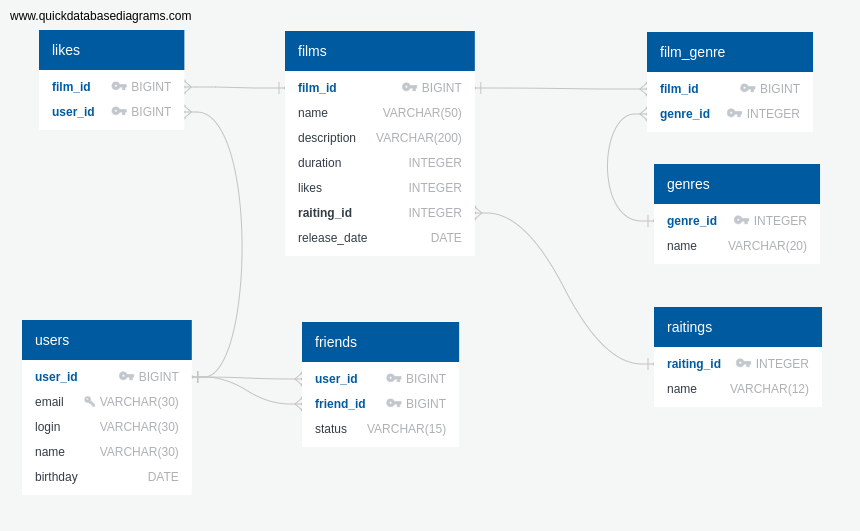

# Filmorate
## Описание проекта
Данный репозиторий содержит учебный проект Filmorate. В рамках этого проекта создается бекэнд простого сервиса для
определения рейтингов фильмов, которые формируются на основе лайков пользователей.

Функционал сервиса позволяет управлять пользователя, которые им пользуются и фильмами. Для управления пользователями 
доступны следующие команды:
- Создать нового пользователя;
- Изменить существующего пользователя;
- Добавить пользователя А в друзья пользователя В;
- Удалить пользователя А из друзей пользователя В;
- Получить список всех пользователей;
- Получить конкретного пользователя по его Id;
- Получить список друзей конкретного пользователя;
- Получить список общих друзей пользователей А и В

Для управления фильмами доступны команды:

- Добавить новый фильм;
- Изменить существующий фильм;
- Добавить лайк конкретному фильму;
- Удалить лайк у конкретного фильма;
- Получить список всех фильмов;
- Получить фильм по его Id;
- Получить топ N фильмов, упорядоченных по убыванию рейтинга;
- Получить список всех жанров фильмов, доступных в сервисе;
- Получить список всех возрастных рейтингов фильмов, доступных в сервисе;

## База данных
Все данные сервиса хранятся в базе данных (БД).  ER-диаграмма этой БД представлены на схеме ниже.



БД состоит из 6 таблиц, четыре из которых используется для хранения данных о фильмах, а оставшиеся 2 - для хранения 
данных о пользователях.

### Описание таблиц
#### Таблицы для хранения данных о фильмах
Для хранения информации о фильмах используются следующие таблицы:

- ratings
- genres
- films
- film_genre

Ниже приводится краткое описание каждой из этих таблиц.

##### Таблица *ratings*
Данная таблица используется для хранения списка доступных возрастных рейтингов, которые можно назначать фильмам. 
Таблица содержит два столбца:

- **rating_id** - идентификатор рейтинга. Значение этого столбца генерируется автоматически СУБД при добавлении каждой новой 
строки. Это первичный ключ таблицы *ratings*.
- **name** - название рейтинга, например "PG". Значение этой колонки не может быть `NULL` (ограничение `NOT NULL`).

##### Таблица *genres*
Эта таблица используется для хранения списка доступных жанров фильмов, которые можно назначать фильмам при их создании 
или изменении. Данная таблица так же состоит из двух столбцов:

- **genre_id** - идентификатор жанра. Значение этого столбца генерируется автоматически СУБД при добавлении каждой новой
  строки. Это первичный ключ таблицы *genres*.
- **name** - название жанра, например "Комедия". Значение этой колонки не может быть `NULL` (ограничение `NOT NULL`).

##### Таблица *films*
Данная таблица используется для хранения списка фильмов. Эта таблица содержит 7 столбцов:

- **film_id** - идентификатор фильма. Значение этого столбца генерируется бизнес-логикой сервиса. Это первичный ключ 
таблицы *films*.
- **name** - название фильма.  Значение этой колонки не может быть `NULL` (ограничение `NOT NULL`).
- **description** - описание фильма. Значение этой колонки не может быть `NULL` (ограничение `NOT NULL`).
- **duration** - длительность фильма в минутах. Значение этой колонки не может быть `NULL` (ограничение `NOT NULL`). 
Также, значение этого поля не может равняться 0 или быть отрицательным (ограничение `CHECK(duration>0)`). 
- **likes** - количество лайков. Значение этой колонки не может быть `NULL` (ограничение `NOT NULL`). По-умолчанию этому
полю присваивается значение 0 (ограничение `DEFAULT 0`).
- **rating_id** - идентификатор возрастного рейтинга. Это внешний ключ таблицы *films*, который ссылается на поле 
*rating_id* таблицы *ratings*. Значение этой колонки не может быть `NULL` (ограничение `NOT NULL`).
- **release_date** - дата релиза фильма. Значение этой колонки не может быть `NULL` (ограничение `NOT NULL`).

##### Таблица *film_genre*
Данная таблица используется для хранения жанров, связанных с тем или иным фильмом. Таблица содержит два столбца:

- **film_id** - идентификатор фильма. Это первая часть составного первичного ключа таблицы *film_genre*. Также, это поле
является внешним ключом данной таблицы, который ссылается на поле *film_id* таблицы *films*. Данная колонка имеет 
дополнительное ограничение на операцию удаления: `ON DELETE CASCADE`.
- **genre_id** - идентификатор жанра. Это вторая часть составного первичного ключа таблицы *film_genre*. Кроме этого, 
данное поле - внешний ключ таблицы *film_genre*, который ссылается на поле *genre_id* таблицы *genres*. Эта колонка 
так же, как и предыдущая имеет ограничение на операцию удаления: `ON DELETE CASCADE`.

#### Таблицы для хранения информации о пользователях
Для хранения информации о пользователях используются две таблицы:

- users
- friends

Краткое описание этих таблиц приводится в следующих подразделах.

##### Таблица *users*
Эта таблица хранит информацию оо пользователя. Она состоит из 5 колонок:

- **user_id** - идентификатор пользователя. Значение этого столбца генерируется бизнес-логикой сервиса. Это первичный 
ключ таблицы *users*.
- **email** - адрес электронной почты пользователя. Это поле имеет ограничение `UNIQUE` и не может быть `NULL` 
(ограничение `NOT NULL`).
- **login** - логин пользователя. Значение этой колонки не может быть `NULL` (ограничение `NOT NULL`).
- **name** - имя пользователя. Значение этой колонки не может быть `NULL` (ограничение `NOT NULL`).
- **birthday** - дата рождения пользователя. Значение этой колонки не может быть `NULL` (ограничение `NOT NULL`).

##### Таблица *friends*
Эта таблица используется для хранения списков друзей пользователей и содержит 3 колонки:

- **user_id** - идентификатор пользователя. Это первая часть составного первичного ключа таблицы *friends*. Также, это 
поле является внешним ключом данной таблицы, который ссылается на поле *user_id* таблицы *users*. Данная колонка имеет
дополнительное ограничение на операцию удаления: `ON DELETE CASCADE`.
- **friend_id** - идентификатор пользователя, который является "другом" для пользователя с идентификатором *user_id*.
Кроме этого, данное поле - внешний ключ таблицы *friends*, который ссылается на поле *user_id* таблицы *users*. Эта 
колонка так же, как и предыдущая имеет ограничение на операцию удаления: `ON DELETE CASCADE`.
- **status** - статус дружбы: подтверждена или нет. Значение этой колонки не может быть `NULL` (ограничение `NOT NULL`). 
По-умолчанию этому полю присваивается значение 0 (ограничение `DEFAULT 0`).

### Запросы к БД
Чтобы реализовать функции сервиса, которые описаны выше, необходимо получать, добавлять, изменять, удалять данные, 
хранящиеся в БД. Ниже приводятся SQL запросы, которые используются сервисом Filmorate.

#### Запросы для работы с фильмами
##### Работа с таблицей *ratings*
Для получения списка всех возрастных рейтингов из таблицы используется запрос:
```SQL
SELECT * FROM ratings
```
Для получения конкретного рейтинга по его ID используется запрос:
```SQL
SELECT * FROM ratings
WHERE rating_id=ratingId
```
Здесь `ratingId` - идентификатор запрашиваемого рейтинга.

##### Работа с таблицей *genres*
Чтобы получить список всех жанров из данной таблицы, используется запрос:
```SQL
SELECT * FROM genres
```
Для получения одного жанра по его ID используется запрос:
```SQL
SELECT * FROM genres
WHERE genre_id=genreId
```
Здесь `genreId` - идентификатор жанра, который нужно получить.

##### Работа с таблицей *films*
Для получения списка всех фильмов из таблицы *films* используется запрос:
```SQL
SELECT f.film_id AS f_id,
       f.name AS f_name,
       f.description AS f_description,
       f.duration AS f_duration,
       f.likes AS f_likes,
       r.rating_id AS r_id,
       r.name AS r_name,
       f.release_date AS f_date
FROM films AS f
LEFT JOIN ratings AS r ON f.rating_id=r.rating_id
```
Следующий запрос позволяет получить фильм по его ID: 
```SQL
SELECT f.film_id AS f_id, 
       f.name AS f_name,
       f.description AS f_description,
       f.duration AS f_duration,
       f.likes AS f_likes,
       r.rating_id AS r_id,
       r.name AS r_name,
       f.release_date AS f_date
FROM (SELECT * FROM films WHERE film_id=filmId) AS f
LEFT JOIN ratings AS r ON f.rating_id=r.rating_id
```
Здесь `filmId` - идентификатор фильма, который нужно получить.
Данный запрос вернет топ я `size` фильмов, упорядоченных поо убыванию количества лайков:
```SQL
SELECT f.film_id AS f_id,
       f.name AS f_name,
       f.description AS f_description,
       f.duration AS f_duration,
       f.likes AS f_likes,
       r.rating_id AS r_id,
       r.name AS r_name,
       f.release_date AS f_date
FROM (SELECT * FROM films
ORDER BY likes DESC
LIMIT size) AS f
LEFT JOIN ratings AS r ON f.rating_id=r.rating_id
```
Здесь `size` - определяет максимальное количество фильмов, которое вернет запрос.
Для добавления/изменения фильма в таблице *films* используется запрос:
```SQL
MERGE INTO films VALUES (filmId, name, description, duration, likes, ratingId, releaseDate)
```
Здесь: 

- `filmId` - идентификатор фильма;
- `name` - название фильма;
- `description` - описание фильма;
- `duration` - длительность фильма;
- `likes` - количество лайков;
- `ratingId` - идентификатор возрастного рейтинга;
- `releaseDate` - дата релиза фильма.

##### Работа с таблицей *film_genre*
Чтобы получить список жанров для конкретного фильма, используется запрос:
```SQL
SELECT g.genre_id AS id,
       g.name AS name
FROM (SELECT * FROM film_genre WHERE film_id=filmId) AS fg
LEFT JOIN genres AS g ON fg.genre_id=g.genre_id
```
Здесь `filmId` - идентификатор фильма, для которого нужно получить список жанров.
Следующий запрос позволяет получить список жанров для всех фильмов:
```SQL
SELECT fg.film_id AS f_id,
       g.genre_id AS id,
       g.name AS name
FROM film_genre AS fg
LEFT JOIN genres AS g ON fg.genre_id=g.genre_id
```
Данный запрос удаляет все жанры для фильма с заданным идентификатором: 
```SQL
DELETE FROM film_genre WHERE film_id=filmId
```
Здесь `filmId` - идентификатор фильма, для которого нужно удалить жанры.
Для добавления жанра к заданному фильму используется запрос:
```SQL
INSERT INTO film_genre VALUES (filmId, genreId)
```
Здесь:

- `filmId` - идентификатор фильма;
- `genreId` - идентификатор жанра.

#### Запросы для работы с пользователями
##### Работа с таблицей *users*
Для добавления/изменения пользователя используется запрос:
```SQL
MERGE INTO users (user_id, email, login, name, birthday)
VALUES (userId, email, login, name, birthday)
```
Здесь:

- `userId` - идентификатор пользователя;
- `email` - адрес электронной почты пользователя;
- `login` - логин пользователя;
- `name` - имя пользователя;
- `birthday` - день рождения пользователя;

Данный запрос позволяет получить пользователя по его ID:
```SQL
SELECT user_id, email, login, name, birthday
FROM users 
WHERE user_id=userId
```
Здесь `userId` - идентификатор пользователя, информацию о котором нужно получить.
Следующий запрос вернет информацию обо всех пользователях:
```SQL
SELECT * FROM users
```

##### Работа с таблицей *friends*
Для добавления пользователя А в друзья пользователя B используется запрос:
```SQL
MERGE INTO friends (user_id, friend_id) VALUES (userBId, userAId)
```
Здесь:

- `userAId` - идентификатор пользователя, которого нужно добавить в друзья пользователя В.
- `userBId` - идентификатор пользователя в список друзей которого, добавляется пользователь А.
Следующий запрос удаляет пользователя А из списка друзей пользователя В:
```SQL
DELETE FROM friends
WHERE user_id=userBId AND friend_id=userAId
```
Здесь:

- `userAId` - идентификатор пользователя, которого нужно удалить из друзей пользователя В.
- `userBId` - идентификатор пользователя из списка друзей которого, удаляется пользователь А.

Для получения списка всех друзей конкретного пользователя используется запрос:
```SQL
SELECT u.user_id AS u_id,
       u.email AS email,
       u.login AS login,
       u.name AS name,
       u.birthday AS birthday,
FROM (SELECT friend_id
      FROM friends
      WHERE user_id=userId) AS f
LEFT JOIN users AS u ON f.friend_id=u.user_id
```
Здесь `userId` - идентификатор пользователя, для которого нужно получить список друзей.

### Инициализация БД
При запуске приложения первоначальная инициализация БД производится при помощи двух скриптов. Для создания таблиц БД 
используется [скрипт](src/main/resources/schema.sql). Добавление данных о жанрах и возрастных рейтингах осуществляется
при помощи [данного скрипта](src/main/resources/data.sql).